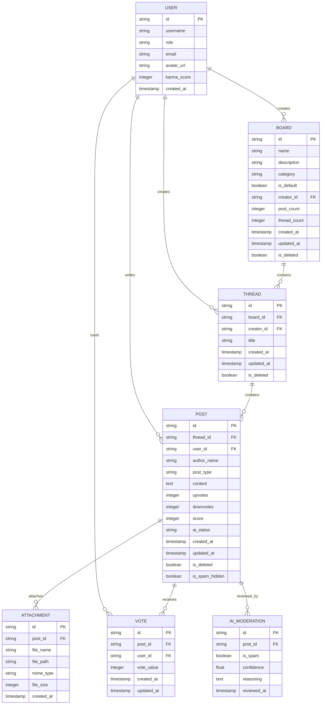
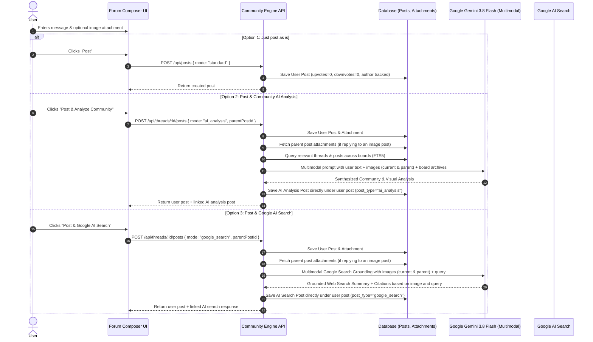
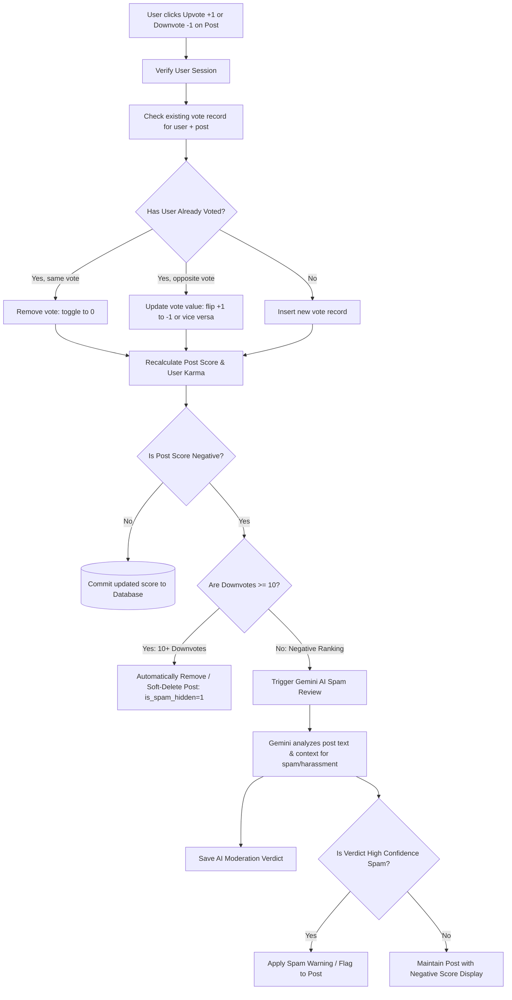
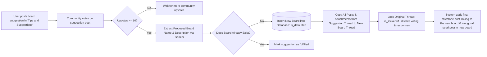
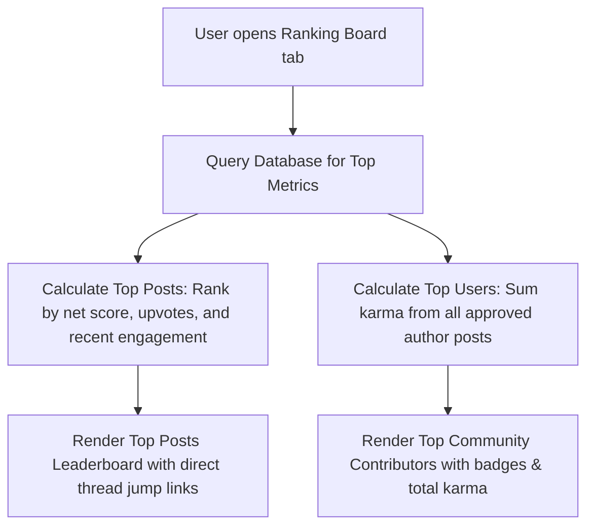

# Community AI Archive - Architecture & System Specifications

This document outlines the complete system architecture, component breakdown, key technical processes, data design, and operational specifications for the **Community AI Archive** application.

---

## 1. System Outline & Component Hierarchy

The Community AI Archive is structured into four primary layers, designed for a cloud-ready community forum that combines the familiar conversational UX of the Personal AI Archive with multi-user boards, threads, upvoting/ranking, Gemini AI board analysis, Google AI Search, and automated AI spam moderation.

```
Community AI Archive
├── 1. Presentation Layer (Frontend UI)
│   ├── Board Directory & Search View (Default system boards, top user boards, search & filter)
│   ├── Board & Thread Explorer (Layout mirroring Personal AI Archive, thread timeline, post list)
│   ├── Thread Creation & Composer (First post becomes thread title, image attachment uploader)
│   ├── Triple-Action Posting Toolbar:
│   │   ├── Option 1: Just post as is
│   │   ├── Option 2: Post & AI Board Analysis (Gemini synthesizes community knowledge)
│   │   └── Option 3: Post & Google AI Search (Grounds post in live web results)
│   ├── Interactive Voting & Sentiment Controls (+1 / -1 per user, real-time score display)
│   ├── Community Ranking Board (Leaderboard of top posts and most helpful community members)
│   ├── Board Proposal Hub (Auto-board creation after 10 votes in "Tips and Suggestions")
│   └── User Identity Switcher / Auth Bar (Self-service test auth transitioning to Google Auth)
│
├── 2. Core Service Layer (Application Engine)
│   ├── Community Board & Thread Manager (CRUD, thread initialization from first post)
│   ├── Vote & Karma Engine (Single vote per user enforcement, score tallying, ranking calculation)
│   ├── Board Suggestion & Promotion Worker (Monitors "Tips and Suggestions", promotes at 10 upvotes)
│   ├── Community Knowledge Synthesis Engine (RAG across community boards using Gemini)
│   ├── Google AI Search Grounding Worker (Live web queries formatted as official AI response posts)
│   └── AI Spam & Moderation Engine (Triggers on negative vote thresholds, auto-purges at 10 downvotes)
│
├── 3. Data & Storage Layer (Persistence & Security)
│   ├── SQLite / Cloud Relational Database (Users, Boards, Threads, Posts, Votes, Media)
│   ├── FTS5 Virtual Index (Fast full-text indexing across boards, threads, and posts)
│   ├── Media & Image Attachment Store (Local/Cloud file storage for post image uploads)
│   └── Audit, Spam & Moderation Log (Tracks AI spam analysis, hidden content, and vote changes)
│
└── 4. AI Provider Integration Layer (Exclusively Google Gemini & Google Search)
    ├── Google Gemini Model Adapter (gemini-2.5-flash / gemini-2.5-pro / gemini-3-series for analysis & moderation)
    ├── Google Search Grounding API (Live web search extraction with source attribution)
    └── Spam & Toxicity Classifier Prompt Pipeline (Structured safety assessment for flagged posts)
```

---

## 2. Storage, Data Schema & Entity Relationships

The data schema evolves from the personal archive into a multi-user, board-and-thread model with voting and AI assistance.

### Entity Relationship Model



### Default Pre-Populated Boards
Upon system initialization, the following core default boards are seeded:
1. **Community notices**: Announcements, community guidelines, and important updates.
2. **Buy, sell and swap**: Community marketplace for items and services.
3. **Events and activities**: Local and virtual meetups, webinars, and gatherings.
4. **Lost and found**: Lost items, found belongings, and pet inquiries.
5. **Job opportunities**: Job postings, project contracts, and skill offerings.
6. **Tips and suggestions**: Community suggestions and board creation proposals.

---

## 3. Key Processes & Execution Flows

### Process 1: Triple-Option Post Submission Flow (with Multimodal Image Recognition & Inheritance)

When a user writes a post (whether opening a new thread or replying to an existing one), they can attach an image and choose one of three submission modes:



#### Multimodal Image Recognition & Context Inheritance
1. **Direct Post Image Understanding**: Images attached to a post are encoded as base64 inline data and passed directly into Gemini 3.8 Flash along with the prompt.
2. **Context Inheritance on Replies**: When replying to a post that contains an image, the backend queries `attachments` for the `parent_post_id` and feeds the original image(s) to Gemini alongside the reply.
3. **UI Transparency**: When drafting a reply to an image post, the composer displays a chip indicating `AI includes @author's photo`, letting the user know they can ask questions about the photo without re-uploading it.

---

### Process 2: Voting, Karma Engine & AI Spam Moderation



1. **Strict 1-Vote-Per-User Rule for Community Members**: Regular users can only cast one vote (+1 or -1) per post; clicking the same vote toggles/cancels it.
2. **Admin Multi-Vote for Testing**: Accounts with the `admin` role (e.g. Dean) are exempted from the 1-vote limit, allowing each click to increment (+1) or decrement (-1) the post score immediately so you can test the 10-vote board creation and spam thresholds without switching profiles.
3. **Admin Manual Thread Locking & Unlocking**: Board administrators can manually lock or unlock any thread at any time via the thread header. Locking immediately closes replies and voting, posts an official administrator notice in the thread, and displays a locked indicator across the board.
4. **AI Analysis Posts Exempt from Voting**: AI-generated responses (community synthesis and Google search answers) do not display voting buttons.
5. **AI Spam Screening**: Once a user's post drops into negative territory (downvotes > upvotes), the backend automatically submits the content to Gemini for spam detection.
6. **Automated Purge at 10 Downvotes**: If a post accumulates 10 or more negative votes, it is automatically hidden/removed from community boards.

---

### Process 3: Board Suggestion & 10-Vote Automated Board Creation

Users can propose new community boards (e.g. *Quest boards - for gamers*, *Enthusiast groups*, *Language learners*, *Movies*, *Books*) directly inside the **Tips and Suggestions** board:



1. **Board Proposal**: Users author suggestions in *Tips and Suggestions*.
2. **Community Consensus (10 Votes)**: Once net upvotes reach 10, the Gemini AI worker extracts the formal board name, slug, category, and description.
3. **Automated Seed Migration**: An inaugural thread is created in the new board, and **all posts, nested replies, attachments, and media** from the suggestion thread are copied over to preserve context and momentum.
4. **Thread Locking & Closed State**: The original proposal thread is immediately locked (`is_locked = 1`). No further responses or voting are permitted.
5. **Final Linking Post & Transition**: A final milestone post from Community AI appears on the original thread containing a direct navigation button/link to the new board, directing users to continue discussions there. Both threads display lock and graduation badges.

---

### Process 4: Community Rankings & Leaderboard Flow



---

## 4. UI/UX Specifications (Preserving Personal Archive Design)

To ensure continuity and a unified family feel:
- **Sidebar & Board Directory**: Replaces the local conversation list with an intuitive Board Directory, featuring default badges, user boards, a "Tips & Suggestions" shortcut, and a search filter.
- **Top Bar**: Displays the active Board name, thread topic breadcrumb, and User Profile/Switcher (e.g. *Dean (Online)*), alongside a global Google AI Search shortcut and Leaderboard toggle.
- **Thread & Chat Layout**: Preserves the modern, clean layout of the Personal AI Archive:
  - User posts are styled cleanly with author name, timestamp, and score counter.
  - Image attachments appear with sleek rounded thumbnails and lightbox preview.
  - AI responses (Community Synthesis and Google Search Overviews) are distinguished with an AI badge and subtle accent border, omitting vote buttons.
  - Input area provides a multi-line auto-resizing text box, image upload clip button, and clear selection between **Post**, **Post + AI Analyze**, and **Post + Google Search**.

---

## 5. Migration & Implementation Checklist

Below is the concrete roadmap of changes required to transition the copied Personal AI Archive codebase into the complete Community AI Archive:

- [ ] **1. Database Schema Overhaul (`server/db.js`)**:
  - Add tables for `users`, `boards`, `threads`, `posts`, `post_votes`, `board_proposals`, and `ai_moderation_reviews`.
  - Retain FTS5 virtual table indexing for posts and threads.
  - Seed default boards (*Community notices, Buy, sell and swap, Events and activities, Lost and found, Job opportunities, Tips and suggestions*).
  - Seed default demo users for testing.
- [ ] **2. Gemini-Exclusive Provider Adapter (`server/providers.js`)**:
  - Strip external OpenAI/Ollama/LMStudio multi-router complexity; standardize directly on Google Gemini API.
  - Implement Gemini prompts for:
    - Community board knowledge synthesis (RAG across threads).
    - Google AI Search query expansion and response formatting.
    - AI spam & content moderation review.
    - Board proposal title/category extractor.
- [x] **3. REST & Action Endpoints (`server/index.js`)**:
  - User registration & switching with role management (`admin` / `user`) (`/api/users`, `/api/auth/register`, `/api/auth/login`).
  - Board listing, search, and details (`/api/boards`, `/api/boards/:id`).
  - Thread creation and retrieval (`/api/boards/:id/threads`, `/api/threads/:id`).
  - Post creation with the 3 submission options, nested reply tracking, and multimodal image understanding (`/api/threads/:id/posts`).
  - Post editing with original author verification and FTS re-indexing (`PUT /api/posts/:id`).
  - Post deletion with Board Administrator (`admin`) or Author ownership permissions (`DELETE /api/posts/:id`).
  - Post voting with toggle & 1-vote-per-user check (`/api/posts/:id/vote`).
  - Automated 10-vote board creation worker.
  - Automated AI spam review and 10-negative-vote auto-purge.
  - Community rankings endpoint (`/api/rankings` for top posts and top users).
  - Post image uploads (`/api/upload` storing in `data/media`).
- [ ] **4. Frontend Views & Components (`client/src/`)**:
  - Update `Sidebar.jsx`: Replace conversations list with **Board Directory**, **Search Boards**, and **Rankings** button.
  - Update `ChatView.jsx` -> Thread/Board view:
    - Show author, timestamp, score, and +/- vote buttons for user posts.
    - Render AI response posts distinctly without voting buttons.
    - Render embedded images.
    - Update composer with Image upload button and 3-button action bar (Post, Post + AI Analysis, Post + Google Search).
  - Create `BoardSelectionView.jsx`: Board discovery gallery with default and top user boards.
  - Create `RankingBoardView.jsx`: Leaderboards for top posts and top community members.
  - Add User Switcher modal/selector in header for testing multi-user interactions.
